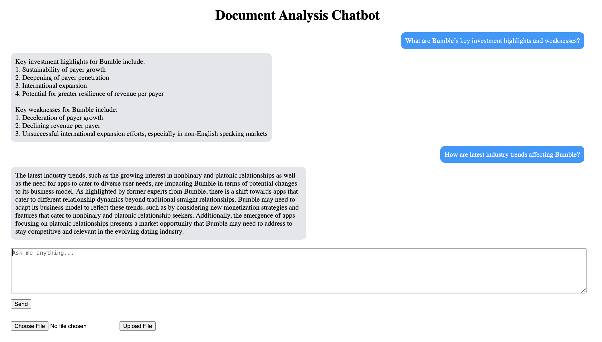

# Python Chatbot for Document Analysis

This chatbot project allows users to upload documents and ask questions about them. It utilizes a Chroma in-memory vector database to efficiently and dynamically access documents and the Chat GPT API as well as other NLP libraries to answer questions about them.

## Features

- **Document Upload**: Users can upload various types of documents, including PDFs and text files, to the chatbot.
- **Question Answering**: The chatbot uses natural language processing (NLP) techniques to analyze the uploaded documents and answer user questions about the document content.
- **Interactive Chat Interface**: Users can interact with the chatbot in a conversational manner, asking questions and receiving answers in real-time.
- **Easy-to-Use**: The chatbot's intuitive user interface makes it easy for users to upload documents and obtain information quickly.

## Installation

Before getting started, ensure you have the following software installed:

- [Python](https://www.python.org/downloads/): If Python is not installed on your system, download and install it from the official Python website.

- [Node.js and npm](https://nodejs.org/): If Node.js and npm are not installed on your system, download and install them from the official Node.js website.

- [Git](https://git-scm.com/downloads): If Git is not installed on your system, download and install it from the official Git website.

Once you have installed the above software, you can proceed with the following steps.

1. Clone the repository to your local machine:

        git clone https://github.com/mattkaneb1/Document-Analysis-Chatbot.git

2. Navigate to the project directory:

        cd Document-Analysis-Chatbot/

3. Add OpenAI API Key to the following configuration file:

        src/cfg/config.py

4. Install the required python dependencies:

        pip install -r requirements.txt

5. Navigate to client directory

        cd client

6. Install required node dependencies

        npm install

7. Navigate back to the project directory

        cd ..

8. Run the chatbot application:

        ./start_app.sh

## Usage

1. Open the chatbot interface in your web browser.
2. Upload a document by clicking the "Upload Document" button.
3. Once the document is uploaded, you can ask questions about the document content in the chat interface.
4. The chatbot will analyze the document and provide answers to your questions.

## Contributing

Contributions to the project are welcome! If you'd like to contribute, please follow these steps:

1. Fork the repository on GitHub.
2. Create a new branch for your feature or bug fix.
3. Make your changes and commit them to your branch.
4. Push your changes to your fork.
5. Submit a pull request to the main repository.

## Contact

For questions or inquiries about the project, please contact [Matt Kaneb](mailto:matthewkaneb1@gmail.com).
